# LLaDA: Large Language and Diffusion Alignment

This repository contains a complete implementation of LLaDA (Large Language and Diffusion Alignment), a novel approach that combines diffusion models with transformer architectures for text generation.

## Overview

LLaDA modifies the traditional autoregressive language model by:
1. **Removing causal masking** from the self-attention mechanism
2. **Using a diffusion-based training process** with random masking
3. **Implementing specialized sampling methods** for generation

## Architecture

LLaDA is based on a modified LLaMA architecture with key changes for bidirectional attention and diffusion-based training. Below are detailed architectural diagrams with precise dimensions.

### Model Specifications (Llama-3.2-3B Base)

- **Parameters**: 3.78B total parameters
- **Hidden Size**: 3,072
- **Attention Heads**: 24 query heads, 8 key/value heads (GQA)
- **Layers**: 28 transformer layers
- **Vocabulary**: 156,938 tokens (128,256 original + 28,682 TTS tokens)
- **Context Length**: Up to 131,072 tokens (trained on 2048-4096)
- **Position Encoding**: RoPE (Rotary Position Embedding)

### Complete Model Architecture


### Detailed Attention Mechanism (GQA)

The attention mechanism uses Grouped Query Attention (GQA) for memory efficiency:

```mermaid
graph TD
    %% Input
    Input["Input Hidden States<br/>(batch=4, seq_len=2048, hidden=3072)"] --> Linear["Linear Projections"]
    
    %% Linear Projections
    subgraph Projections ["Linear Projections"]
        Linear --> QProj["Q = Linear(3072 → 3072)<br/>Weight: [3072, 3072]<br/>Output: (4, 2048, 3072)"]
        Linear --> KProj["K = Linear(3072 → 1024)<br/>Weight: [3072, 1024]<br/>Output: (4, 2048, 1024)<br/>⚠️ Note: 1024 = 8 heads × 128"]
        Linear --> VProj["V = Linear(3072 → 1024)<br/>Weight: [3072, 1024]<br/>Output: (4, 2048, 1024)<br/>⚠️ Note: 1024 = 8 heads × 128"]
    end
    
    %% Reshape to Multi-Head
    QProj --> QReshape["Q Reshape & Transpose<br/>(4, 2048, 24, 128)<br/>→ (4, 24, 2048, 128)<br/>24 Query Heads"]
    KProj --> KReshape["K Reshape & Transpose<br/>(4, 2048, 8, 128)<br/>→ (4, 8, 2048, 128)<br/>8 Key Heads"]
    VProj --> VReshape["V Reshape & Transpose<br/>(4, 2048, 8, 128)<br/>→ (4, 8, 2048, 128)<br/>8 Value Heads"]
    
    %% RoPE Application
    QReshape --> QRoPE["Apply RoPE to Q<br/>(4, 24, 2048, 128)<br/>Rotary Position Encoding<br/>Base: 500000"]
    KReshape --> KRoPE["Apply RoPE to K<br/>(4, 8, 2048, 128)<br/>Rotary Position Encoding<br/>Base: 500000"]
    
    %% GQA Expansion
    subgraph GQA ["🔄 Grouped Query Attention (GQA)"]
        KRoPE --> KRepeat["Repeat K Heads<br/>(4, 8, 2048, 128)<br/>→ (4, 24, 2048, 128)<br/>Each K head repeated 3 times"]
        VReshape --> VRepeat["Repeat V Heads<br/>(4, 8, 2048, 128)<br/>→ (4, 24, 2048, 128)<br/>Each V head repeated 3 times"]
        
        GQADetail["GQA Grouping:<br/>Q₀,Q₁,Q₂ → K₀,V₀<br/>Q₃,Q₄,Q₅ → K₁,V₁<br/>...<br/>Q₂₁,Q₂₂,Q₂₃ → K₇,V₇"]
    end
    
    %% Attention Computation
    QRoPE --> MatMul["Matrix Multiplication<br/>Q × K^T<br/>(4, 24, 2048, 128) × (4, 24, 128, 2048)<br/>= (4, 24, 2048, 2048)"]
    KRepeat --> MatMul
    
    MatMul --> Scale["Scale by √d_k<br/>Attention / √128<br/>= Attention / 11.31<br/>(4, 24, 2048, 2048)"]
    
    %% NO CAUSAL MASK
    Scale --> NoMask["⚠️ NO CAUSAL MASK<br/>Full bidirectional attention<br/>All positions can attend<br/>to all other positions<br/>(4, 24, 2048, 2048)"]
    
    NoMask --> Softmax["Softmax<br/>Along last dimension<br/>(4, 24, 2048, 2048)<br/>Attention weights sum to 1"]
    
    Softmax --> Dropout["Dropout<br/>p = attention_dropout<br/>(4, 24, 2048, 2048)"]
    
    %% Apply to Values
    Dropout --> AttnOut["Attention × Values<br/>(4, 24, 2048, 2048) × (4, 24, 2048, 128)<br/>= (4, 24, 2048, 128)"]
    VRepeat --> AttnOut
    
    %% Output Processing
    AttnOut --> Transpose["Transpose & Reshape<br/>(4, 24, 2048, 128)<br/>→ (4, 2048, 24, 128)<br/>→ (4, 2048, 3072)"]
    
    Transpose --> OProj["Output Projection<br/>Linear(3072 → 3072)<br/>Weight: [3072, 3072]<br/>Output: (4, 2048, 3072)"]
    
    %% Memory Analysis
    subgraph Memory ["💾 Memory Analysis"]
        MemQ["Q Storage:<br/>4 × 24 × 2048 × 128<br/>= 50.3M values<br/>≈ 201MB (fp32)"]
        MemKV["K,V Storage:<br/>2 × 4 × 8 × 2048 × 128<br/>= 33.6M values<br/>≈ 134MB (fp32)<br/>🎯 3x less than full MHA"]
        MemAttn["Attention Matrix:<br/>4 × 24 × 2048 × 2048<br/>= 402.7M values<br/>≈ 1.6GB (fp32)"]
    end
    
    %% Comparison with Standard MHA
    subgraph Comparison ["📊 GQA vs MHA vs MQA"]
        MHA["Multi-Head Attention (MHA)<br/>Q: 24 heads, K: 24 heads, V: 24 heads<br/>Memory: High, Quality: Best"]
        GQA_["Grouped Query Attention (GQA)<br/>Q: 24 heads, K: 8 heads, V: 8 heads<br/>Memory: Medium, Quality: Good<br/>🎯 Currently Used"]
        MQA["Multi-Query Attention (MQA)<br/>Q: 24 heads, K: 1 head, V: 1 head<br/>Memory: Low, Quality: Lower"]
    end
    
    %% Key Features
    subgraph Features ["🔑 LLaDA Attention Features"]
        F1["❌ No Causal Masking<br/>Bidirectional attention<br/>Unlike standard LLaMA"]
        F2["🔄 Grouped Query Attention<br/>Memory efficient<br/>3:1 query:key ratio"]
        F3["🌀 RoPE Embeddings<br/>Rotary position encoding<br/>Better length extrapolation"]
        F4["🎭 Mask Token Compatible<br/>Handles mask_token_id: 126336<br/>For diffusion training"]
    end

    %% Styling
    classDef inputBox fill:#e3f2fd,stroke:#1976d2,stroke-width:2px
    classDef gqaBox fill:#fce4ec,stroke:#880e4f,stroke-width:3px
    classDef memoryBox fill:#f3e5f5,stroke:#7b1fa2,stroke-width:2px
    classDef compBox fill:#e8f5e8,stroke:#388e3c,stroke-width:2px
    classDef featureBox fill:#fff3e0,stroke:#f57c00,stroke-width:3px
    classDef noMaskBox fill:#ffebee,stroke:#d32f2f,stroke-width:3px
    
    class Projections inputBox
    class GQA gqaBox
    class Memory memoryBox
    class Comparison compBox
    class Features featureBox
    class NoMask noMaskBox
```



### Training Process with Mask Tokens

LLaDA uses a diffusion-based training approach with dynamic masking:

```mermaid
graph TD
    %% Input Data
    Input["Original Sequence<br/>['Hello', 'world', 'this', 'is', 'TTS', '&lt;audio_token_1&gt;', '&lt;audio_token_2&gt;']<br/>Token IDs: [1234, 5678, 9012, 3456, 7890, 128256, 128257]"] 
    
    %% Forward Diffusion Process
    Input --> Diffusion["🎭 Forward Diffusion Process<br/>LLaDA Masking Strategy"]
    
    subgraph DiffusionDetail ["🎭 Forward Diffusion Process"]
        Step1["Step 1: Sample time t<br/>t ~ Uniform(0, 1)<br/>Example: t = 0.3"]
        
        Step2["Step 2: Calculate mask probability<br/>p_mask = (1 - ε) × t + ε<br/>p_mask = (1 - 0.001) × 0.3 + 0.001<br/>p_mask = 0.3007"]
        
        Step3["Step 3: Sample mask for each token<br/>mask ~ Bernoulli(p_mask)<br/>Example: [0, 1, 0, 1, 0, 1, 1]<br/>1 = mask, 0 = keep"]
        
        Step4["Step 4: Apply masking<br/>Replace masked tokens with mask_token_id<br/>mask_token_id = 126336"]
        
        Result["Masked Sequence:<br/>['Hello', '[MASK]', 'this', '[MASK]', 'TTS', '[MASK]', '[MASK]']<br/>Token IDs: [1234, 126336, 9012, 126336, 7890, 126336, 126336]"]
    end
    
    Diffusion --> Step1
    Step1 --> Step2
    Step2 --> Step3
    Step3 --> Step4
    Step4 --> Result
    
    %% Model Processing
    Result --> Embedding["Token Embedding<br/>(batch_size, seq_len, 3072)<br/>Extended vocabulary: 156938 tokens<br/>Including TTS tokens: 128256-156937"]
    
    Embedding --> Layers["LLaDA Transformer<br/>28 layers with non-causal attention<br/>(batch_size, seq_len, 3072)"]
    
    Layers --> Output["Model Output<br/>Logits over full vocabulary<br/>(batch_size, seq_len, 156938)"]
    
    %% Loss Computation
    subgraph LossComp ["📊 Loss Computation"]
        Output --> MaskSelect["Select Masked Positions<br/>Only compute loss where<br/>original mask = 1<br/>Focus on [MASK] tokens only"]
        
        MaskSelect --> CrossEnt["Cross-Entropy Loss<br/>L = -log(p_target)<br/>Where p_target is probability<br/>of correct token"]
        
        CrossEnt --> Weight["Weight by Inverse Masking<br/>Loss_weighted = L / (1 - t)<br/>Higher weight for higher t<br/>Harder examples get more weight"]
        
        Weight --> FinalLoss["Final Loss<br/>Mean over all masked positions<br/>Backpropagate to update model"]
    end
    
    %% Training Types
    subgraph TrainingTypes ["🎓 Training Variants"]
        PreTrain["Pre-training:<br/>• Random masking strategy<br/>• Mixed text/audio sequences<br/>• Diffusion-based objective<br/>• Learn bidirectional representations"]
        
        SFT["Supervised Fine-Tuning (SFT):<br/>• Prompt preservation<br/>• Only compute loss on answers<br/>• Length normalization<br/>• Task-specific adaptation"]
        
        TTS["TTS Training:<br/>• Text → Audio token sequences<br/>• Custom audio vocabulary<br/>• Mixed ratio training<br/>• End-to-end speech synthesis"]
    end
    
    %% Key Differences
    subgraph KeyDiff ["🔑 Key Differences from Standard LM"]
        Diff1["🎭 Mask Token Training<br/>Not next-token prediction<br/>Learn to fill in blanks<br/>Similar to BERT but with diffusion"]
        
        Diff2["🔄 Non-Causal Attention<br/>Can see future context<br/>Better for reconstruction tasks<br/>Full bidirectional processing"]
        
        Diff3["⚖️ Weighted Loss Function<br/>Adaptive difficulty<br/>Focus on harder masks<br/>t-dependent weighting"]
        
        Diff4["🎵 Extended Vocabulary<br/>Text + Audio tokens<br/>Unified representation<br/>Multi-modal capability"]
    end
    
    %% Example Walkthrough
    subgraph Example ["📝 Training Example"]
        Ex1["Input: 'The cat sat on the [AUDIO]'<br/>Tokens: [123, 456, 789, 012, 345, 128256]"]
        
        Ex2["Mask at t=0.5:<br/>'[MASK] cat [MASK] on the [AUDIO]'<br/>Tokens: [126336, 456, 126336, 012, 345, 128256]"]
        
        Ex3["Model predicts:<br/>Position 0: 'The' (correct)<br/>Position 2: 'sat' (correct)<br/>Loss computed only on these positions"]
        
        Ex4["Weighted Loss:<br/>L = (-log(P('The')) - log(P('sat'))) / (1 - 0.5)<br/>L = (-log(0.8) - log(0.9)) / 0.5<br/>L = 0.67 (higher weight for t=0.5)"]
    end

    %% Model Architecture Summary
    subgraph ArchSummary ["🏗️ Architecture Summary"]
        Arch1["Model Size: 3.78B parameters<br/>Hidden Size: 3072<br/>Attention Heads: 24 (Q) / 8 (KV)<br/>Layers: 28"]
        
        Arch2["Vocabulary: 156,938 tokens<br/>Original: 128,256<br/>Audio: 28,672 (7×4096)<br/>Special: 10"]
        
        Arch3["Context Length: 131,072 tokens<br/>Training Length: 2048-4096<br/>Position Encoding: RoPE<br/>Attention: Non-causal GQA"]
        
        Arch4["Training Objective:<br/>Masked Language Modeling<br/>Diffusion-based masking<br/>Time-dependent weighting"]
    end

    %% Styling
    classDef diffusionBox fill:#e1f5fe,stroke:#0277bd,stroke-width:3px
    classDef lossBox fill:#f3e5f5,stroke:#7b1fa2,stroke-width:2px
    classDef trainingBox fill:#e8f5e8,stroke:#2e7d32,stroke-width:2px
    classDef keyBox fill:#fff3e0,stroke:#ef6c00,stroke-width:3px
    classDef exampleBox fill:#fce4ec,stroke:#c2185b,stroke-width:2px
    classDef archBox fill:#e0f2f1,stroke:#00796b,stroke-width:2px
    classDef maskBox fill:#ffebee,stroke:#d32f2f,stroke-width:2px
    
    class DiffusionDetail diffusionBox
    class LossComp lossBox
    class TrainingTypes trainingBox
    class KeyDiff keyBox
    class Example exampleBox
    class ArchSummary archBox
    class Result maskBox
```



### Key Architectural Features

#### Grouped Query Attention (GQA)
```
24 Query heads: Q₀, Q₁, Q₂, ..., Q₂₃
8 Key/Value heads: K₀, V₀, K₁, V₁, ..., K₇, V₇

Grouping:
- Q₀, Q₁, Q₂ → K₀, V₀
- Q₃, Q₄, Q₅ → K₁, V₁
- ...
- Q₂₁, Q₂₂, Q₂₃ → K₇, V₇
```

#### Memory Footprint (batch=4, seq_len=2048)
- **Q Storage**: 201MB (24 heads × 128 dim)
- **K,V Storage**: 134MB (8 heads × 128 dim) - **3x savings**
- **Attention Matrix**: 1.6GB (24 × seq_len²)

#### Extended Vocabulary for TTS
- **Original LLaMA**: 128,256 tokens
- **Audio Tokens**: 28,672 (7 codebooks × 4,096 vocab each)
- **Special Tokens**: 10 additional task-specific tokens
- **Total**: 156,938 tokens

#### Non-Causal vs Causal Attention
- **Standard LLaMA**: Causal mask prevents attending to future tokens
- **LLaDA**: **NO causal mask** - full bidirectional attention
- **Benefit**: Better for reconstruction/infilling tasks
- **Trade-off**: Cannot be used for autoregressive generation

This architecture enables LLaDA to excel at masked language modeling tasks while being memory-efficient through GQA and supporting both text and audio token sequences for TTS applications.

## Installation

1. Clone the repository:
```bash
git clone <repository-url>
cd LLaDA
```

2. Install dependencies:
```bash
pip install -r requirements.txt
```

3. (Optional) Install with development dependencies:
```bash
pip install -e .
```

## Quick Start

### Text Generation (Standard LLaDA)

#### 1. Create Configuration Files

Generate sample configuration files:
```bash
python train_llada.py create-configs
```

This creates `pretraining_config.json` and `sft_config.json` with default settings.

#### 2. Pre-training

```bash
python train_llada.py pretrain \
  --data_path ./pretraining_data \
  --output_dir ./llada_pretrained \
  --batch_size 8 \
  --learning_rate 5e-4 \
  --epochs 3
```

#### 3. Supervised Fine-tuning

```bash
python train_llada.py sft \
  --model_name_or_path ./llada_pretrained \
  --data_path ./sft_data \
  --output_dir ./llada_sft \
  --batch_size 4 \
  --learning_rate 1e-5 \
  --epochs 2
```

#### 4. Inference

```bash
python train_llada.py inference \
  --model_name_or_path ./llada_sft \
  --sampling_method fixed_length \
  --remasking_strategy low_confidence \
  --interactive
```

### Text-to-Speech (TTS) Training

LLaDA supports specialized TTS training with custom audio tokens for autoregressive speech synthesis.

#### 1. Create TTS Configuration

Generate a sample TTS configuration:
```bash
python train_llada_tts.py --create-sample-config
```

This creates `sample_tts_config.yaml` with optimized settings.

#### 2. TTS Training

Train LLaDA for TTS with your dataset:
```bash
python train_llada_tts.py --config sample_tts_config.yaml
```

#### 3. Mixed Text + TTS Training

For joint text and speech modeling, specify both datasets in your config:
```yaml
# Both datasets for mixed training
text_QA_dataset: "/path/to/text/dataset" 
TTS_dataset: "/path/to/tts/dataset"
ratio: 0.5  # 50% text, 50% TTS

# Or TTS-only training (default if text_QA_dataset not provided)
TTS_dataset: "/path/to/tts/dataset"
# ratio automatically set to 0.0 for TTS-only
```

#### 4. TTS Configuration Example

```yaml
# Dataset configuration
TTS_dataset: "/workspace/combined_tts_dataset_pretrain"
# text_QA_dataset: "/path/to/text/dataset"  # Optional for mixed training

# Model configuration  
model_name: "meta-llama/Llama-3.2-3B-Instruct"
tokenizer_name: "meta-llama/Llama-3.2-3B-Instruct"

# Training arguments - Optimized for H100 80GB
epochs: 10
batch_size: 8
gradient_accumulation_steps: 1
number_processes: 4
save_epochs: 1  # Save every epoch
learning_rate: 5.0e-5
lr_scheduler_type: "linear"
max_grad_norm: 1.0
max_length: 2048

# Paths and logging
save_folder: "checkpoints_llada_tts"
project_name: "llada-tts-experiment" 
run_name: "llada-tts-run-1"
```

#### 5. TTS Features

- **🎵 Audio Token Support**: Automatically adds 28,682 custom audio tokens (7 codebooks × 4096 vocab + 10 special tokens)
- **📊 Epoch-Based Training**: Clean epoch-based training instead of step-based
- **💾 Smart Checkpointing**: Save after each epoch with `checkpoint-epoch-N/` naming
- **⚡ Memory Optimized**: FSDP, gradient checkpointing, mixed precision for large models
- **📈 Advanced Logging**: Separate loss tracking for text vs audio with Weights & Biases
- **🔄 Mixed Training**: Support for joint text and TTS training with configurable ratios

## Data Format

### Pre-training Data

Pre-training data should be in JSONL format with tokenized sequences:

```json
{"input_ids": [1, 2, 3, ..., 1000]}
{"input_ids": [1, 2, 3, ..., 1500]}
```

### SFT Data

SFT data should include both input sequences and prompt lengths:

```json
{"input_ids": [1, 2, 3, ..., 1000], "prompt_length": 50}
{"input_ids": [1, 2, 3, ..., 800], "prompt_length": 30}
```

Alternatively, use conversation format:
```json
{
  "conversations": [
    {"from": "user", "value": "What is the capital of France?"},
    {"from": "assistant", "value": "The capital of France is Paris."}
  ]
}
```

### TTS Data

TTS datasets should be in HuggingFace datasets format with the following structure:

#### For Local Datasets (saved with `save_to_disk`)
```
/path/to/tts_dataset/
├── data-00000-of-00001.arrow
├── dataset_info.json
├── metadata.json
└── state.json
```

#### Required Fields
Each example should contain:
```json
{
  "input_ids": [1, 2, 3, ..., 1000],           # Tokenized sequence including audio tokens
  "attention_mask": [1, 1, 1, ..., 1],         # Attention mask
  "prompt_lengths": 50,                        # Length of text prompt (before audio)
  "data_type": "tts"                           # Data type identifier
}
```

#### Audio Token Format
Audio tokens follow the pattern:
- **Audio tokens**: `<audio_token_0>` to `<audio_token_28671>` (7 codebooks × 4096)
- **Special tokens**: `<special_token_0>` to `<special_token_9>`

Example sequence:
```
"Hello world <audio_token_1234> <audio_token_567> ... <special_token_0>"
```

#### Mixed Text + TTS Dataset
For combined training, the dataset loader automatically handles:
- Text examples (data_type: "text")
- TTS examples (data_type: "tts") 
- Proper batching based on configured ratio

## Training Process

### Pre-training

The pre-training follows the paper's methodology:

1. **Forward Process**: Random masking with probability `p_mask = (1 - eps) * t + eps`
2. **Loss Computation**: Cross-entropy loss weighted by inverse masking probability
3. **Random Length**: 1% of sequences use random lengths from [1, 4096]

Key code from the paper:
```python
def forward_process(input_ids, eps=1e-3):
    b, l = input_ids.shape
    t = torch.rand(b, device=input_ids.device)
    p_mask = (1 - eps) * t + eps
    p_mask = p_mask[:, None].repeat(1, l)
    
    masked_indices = torch.rand((b, l), device=input_ids.device) < p_mask
    noisy_batch = torch.where(masked_indices, 126336, input_ids)
    return noisy_batch, masked_indices, p_mask
```

### Supervised Fine-tuning

SFT modifies the pre-training process by:

1. **Prompt Preservation**: Never mask tokens in the prompt
2. **Answer-only Loss**: Only compute loss on response tokens
3. **Length Normalization**: Normalize loss by answer length

## Sampling Methods

LLaDA supports three sampling methods:

### 1. Fixed-Length Sampling
- Start with all positions masked
- Iteratively unmask tokens
- Fixed output length

### 2. Semi-Autoregressive Origin
- Start with short sequence
- Gradually extend length
- Check for EOS tokens

### 3. Semi-Autoregressive Padding  
- Start with full-length sequence
- Unmask from left to right
- Window-based generation

### Remasking Strategies

- **Random Remasking**: Randomly select tokens to remask
- **Low-Confidence Remasking**: Remask tokens with lowest confidence scores

## Configuration

### Pre-training Config
```json
{
  "pretraining": {
    "model_name_or_path": "meta-llama/Llama-2-7b-hf",
    "output_dir": "./llada_pretrained",
    "data_path": "./pretraining_data",
    "learning_rate": 5e-4,
    "batch_size": 8,
    "gradient_accumulation_steps": 8,
    "epochs": 3,
    "warmup_epochs": 0.1,
    "max_length": 4096,
    "mask_token_id": 126336,
    "eps": 1e-3,
    "random_length_prob": 0.01
  }
}
```

### SFT Config
```json
{
  "sft": {
    "model_name_or_path": "./llada_pretrained",
    "output_dir": "./llada_sft",
    "data_path": "./sft_data",
    "learning_rate": 1e-5,
    "batch_size": 4,
    "gradient_accumulation_steps": 16,
    "epochs": 2,
    "save_epochs": 1
  }
}
```

### TTS Config
```yaml
# Dataset configuration
TTS_dataset: "/workspace/combined_tts_dataset_pretrain"
# text_QA_dataset: "/path/to/text/dataset"  # Optional for mixed training

voice_type: "all"

# Model configuration
model_name: "meta-llama/Llama-3.2-3B-Instruct"
tokenizer_name: "meta-llama/Llama-3.2-3B-Instruct"

# Training arguments - Memory optimized for H100 80GB
epochs: 10
batch_size: 8
gradient_accumulation_steps: 1
number_processes: 4
pad_token: 128263
save_epochs: 1  # Save checkpoint every N epochs
learning_rate: 5.0e-5
lr_scheduler_type: "linear"
max_grad_norm: 1.0
max_length: 2048

# Naming and paths
save_folder: "checkpoints_llada_tts"
project_name: "llada-tts-experiment"
run_name: "llada-tts-run-1"

# TTS-specific settings (optional, will use defaults)
# num_audio_tokens: 28672  # 7 * 4096
# num_special_tokens: 10
# mask_token_id: 126336
# eps: 1e-3
```

### TTS Command Line Options
```bash
# Override config values from command line
python train_llada_tts.py \
  --config sample_tts_config.yaml \
  --epochs 5 \
  --batch_size 4 \
  --learning_rate 1e-5 \
  --save_epochs 2 \
  --output_dir ./custom_checkpoints
```

## Model Analysis

Use the built-in analysis tools:

```python
from utils import ModelAnalyzer, TokenizerHelper
from llada_model import LLaDAForMaskedLM
from sampling import create_sampler

# Load model
model = LLaDAForMaskedLM.from_pretrained("./llada_sft")
analyzer = ModelAnalyzer()

# Analyze attention patterns
analyzer.analyze_attention_patterns(model, input_ids)

# Compare sampling methods
results = analyzer.compare_sampling_methods(model, input_ids)
```

## Data Conversion

Convert existing datasets to LLaDA format:

```python
from utils import TokenizerHelper, DatasetConverter

tokenizer = TokenizerHelper("meta-llama/Llama-2-7b-hf")
converter = DatasetConverter(tokenizer)

# Convert ShareGPT format
converter.convert_sharegpt_to_llada(
    "sharegpt_data.jsonl",
    "llada_sft_data.jsonl"
)

# Convert Alpaca format
converter.convert_alpaca_to_llada(
    "alpaca_data.json",
    "llada_sft_data.jsonl"
)
```

## Key Differences from Standard Transformers

1. **No Causal Masking**: The attention mechanism can attend to all positions
2. **Mask Token Training**: Uses a special mask token (126336) during training
3. **Diffusion Loss**: Loss is weighted by inverse masking probability
4. **Specialized Sampling**: Multiple iterative sampling strategies

## Performance Notes

### For Instruct Models:
- Use **semi-autoregressive padding** with **low-confidence remasking**
- Avoid **semi-autoregressive origin** method
- For long sequences (>512), use **random remasking** to avoid excessive EOS tokens

### For Base Models:
- **Low-confidence remasking** generally works best
- **Fixed-length** and **semi-autoregressive padding** perform similarly

## File Structure

```
LLaDA/
├── llada_model.py          # Core LLaDA model implementation
├── pretraining.py          # Pre-training code  
├── sft_training.py         # Supervised fine-tuning code
├── sampling.py             # Sampling methods implementation
├── train_llada.py          # Main training script (text generation)
├── utils.py                # Utilities and data processing
├── tts_training.py         # TTS training implementation
├── tts_config.py           # TTS configuration classes
├── tts_dataset.py          # TTS dataset handling and data collation
├── train_llada_tts.py      # TTS training script
├── sample_tts_config.yaml  # Sample TTS configuration
├── requirements.txt        # Dependencies
└── README.md              # This file
```
